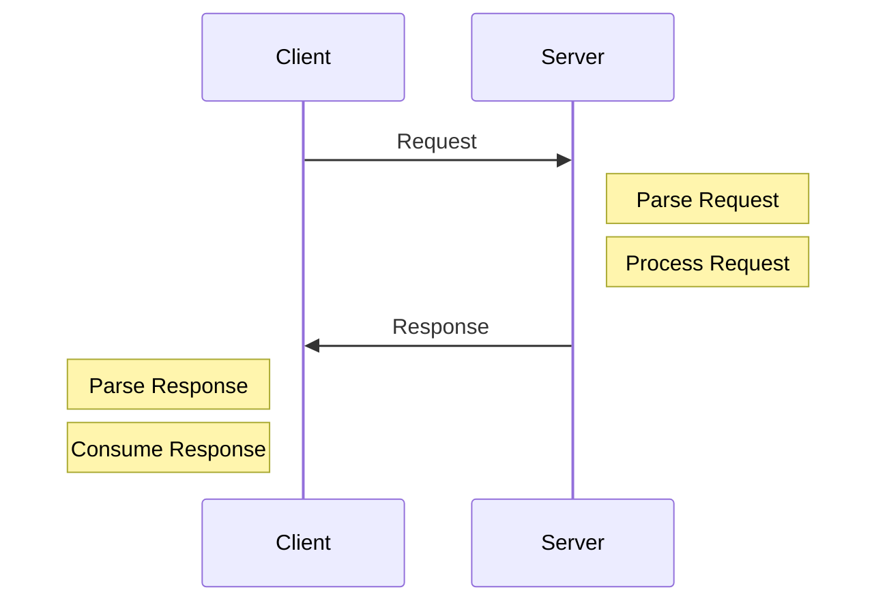

# Request-Response Model

- [Request-Response Model](#request-response-model)
  - [Request-Reponse Model](#request-reponse-model)
  - [Anatomy of Request-Reponse](#anatomy-of-request-reponse)
    - [Request-Reponse를 사용하는 예시](#request-reponse를-사용하는-예시)
    - [Request-Reponse를 사용할 수 없는 경우](#request-reponse를-사용할-수-없는-경우)
  - [Curl을 사용하여 Request-Reponse 확인하기](#curl을-사용하여-request-reponse-확인하기)

Classic, Simple and Everywhere

## Request-Reponse Model

`Request-Reponse` Model은 기본적으로 클라이언트에서 `Request`를 보내면 서버에서 처리하여 `Response`를 보내는 방식입니다.


`Request-Reponse` 사이클의 각 단계를 나누면 다음과 같습니다.



* 클라이언트에서 Request를 보냅니다.
* 서버에서 Request를 파싱합니다.
* 서버에서 파싱된 Request를 처리하고,
* 클라이언트로 Response를 보냅니다.
* 클라이언트는 수신한 Response를 파싱하고 소비합니다.

> 서버에서 Request를 파싱하는 것은 JSON이나 XML을 직렬화하는 것과는 다릅니다. 직렬화는 보통 Request를 처리하는 부분에 해당합니다.

`Request-Reponse` Model는 다양한 곳에서 활용됩니다.

* Web, Http, DNS, SSH
* RPC(Remote Procedure Call)
* SQL and Database Protocols
* APIs(REST, SOAP, GraphQL 등)

## Anatomy of Request-Reponse

`Request`의 구조는 다음과 같습니다.

```shell
GET /HTTP/1.1
Headers
<CRLF>
BODY
```

> `CRLF`란 **줄바꿈**을 의미합니다. `Windows`는 `CRLF`를 기본으로 사용하는 반면, `Unix` 계열에서넌 `LF`를 사용합니다.  

> `CR`(Carriage Return)은 현재 커서에서 맨 앞으로 이동하는 동작이고, `LF`(Line)는 커서는 그대로 있고 줄만 바꾸는 동작입니다. 이는 과거 타자기 시절 페이퍼 롤을 우측으로 이동시키기 위한 명령어에서 유래되었습니다.  

### Request-Reponse를 사용하는 예시

* Request-Reponse를 사용하여 이미지를 업로드하는 서비스

가장 쉬운 방법은 Request에 이미지를 추가하여 보내는 것입니다.

이 경우에는 이미지 파일이 너무 크거나, 클라이언트에서 연결이 끊겨서 중간에 실패했을 경우 복구할 수 없습니다.

하지만 이미지를 여러개의 Chunck로 나누어서 보낸다면 큰 이미지 파일도 분할하여 작은 단위로 요청을 보낼 수 있고, 중간에 실패했을 경우 서버에서 어떤 부분이 필요한지 알 수 있기 떄문에 해당 부분만 다시 받아올 수 있습니다.

### Request-Reponse를 사용할 수 없는 경우

* 알림 서비스
* 채팅 서비스
* 처리가 오래 걸리는 요청인 경우
* 클라이언트가 중간에 연결이 끊기는 경우

## Curl을 사용하여 Request-Reponse 확인하기

다음 명령어를 사용해서 `http://google.com`경로에 요청을 보냅니다.

```bash
curl -v --trace out.txt http://google.com
```

out.txt 파일을 확인하면 Request와 Response에 대한 바이너리 정보를 확인할 수 있습니다.

바이너리 파일에서 가장 먼저 `Request`에 관련된 내용을 볼 수 있습니다.

```bash
== Info:   Trying 142.250.206.238...
== Info: TCP_NODELAY set
== Info: Connected to google.com (142.250.206.238) port 80 (#0)
=> Send header, 74 bytes (0x4a)
0000: 47 45 54 20 2f 20 48 54 54 50 2f 31 2e 31 0d 0a GET / HTTP/1.1..
0010: 48 6f 73 74 3a 20 67 6f 6f 67 6c 65 2e 63 6f 6d Host: google.com
0020: 0d 0a 55 73 65 72 2d 41 67 65 6e 74 3a 20 63 75 ..User-Agent: cu
0030: 72 6c 2f 37 2e 36 34 2e 31 0d 0a 41 63 63 65 70 rl/7.64.1..Accep
0040: 74 3a 20 2a 2f 2a 0d 0a 0d 0a                   t: */*....
# ...
```

다음으로는 `Response`에 대한 내용을 볼 수 있습니다.

```bash
<= Recv header, 32 bytes (0x20)
0000: 48 54 54 50 2f 31 2e 31 20 33 30 31 20 4d 6f 76 HTTP/1.1 301 Mov
0010: 65 64 20 50 65 72 6d 61 6e 65 6e 74 6c 79 0d 0a ed Permanently..
<= Recv header, 34 bytes (0x22)
0000: 4c 6f 63 61 74 69 6f 6e 3a 20 68 74 74 70 3a 2f Location: http:/
0010: 2f 77 77 77 2e 67 6f 6f 67 6c 65 2e 63 6f 6d 2f /www.google.com/
0020: 0d 0a                                           ..
<= Recv header, 40 bytes (0x28)
0000: 43 6f 6e 74 65 6e 74 2d 54 79 70 65 3a 20 74 65 Content-Type: te
0010: 78 74 2f 68 74 6d 6c 3b 20 63 68 61 72 73 65 74 xt/html; charset
0020: 3d 55 54 46 2d 38 0d 0a                         =UTF-8..
```

Response header 부분이 끝나고 Body 부분이 수신된 것을 볼 수 있습니다.

```bash
<= Recv data, 219 bytes (0xdb)
0000: 3c 48 54 4d 4c 3e 3c 48 45 41 44 3e 3c 6d 65 74 <HTML><HEAD><met
0010: 61 20 68 74 74 70 2d 65 71 75 69 76 3d 22 63 6f a http-equiv="co
0020: 6e 74 65 6e 74 2d 74 79 70 65 22 20 63 6f 6e 74 ntent-type" cont
0030: 65 6e 74 3d 22 74 65 78 74 2f 68 74 6d 6c 3b 63 ent="text/html;c
0040: 68 61 72 73 65 74 3d 75 74 66 2d 38 22 3e 0a 3c harset=utf-8">.<
0050: 54 49 54 4c 45 3e 33 30 31 20 4d 6f 76 65 64 3c TITLE>301 Moved<
0060: 2f 54 49 54 4c 45 3e 3c 2f 48 45 41 44 3e 3c 42 /TITLE></HEAD><B
0070: 4f 44 59 3e 0a 3c 48 31 3e 33 30 31 20 4d 6f 76 ODY>.<H1>301 Mov
0080: 65 64 3c 2f 48 31 3e 0a 54 68 65 20 64 6f 63 75 ed</H1>.The docu
0090: 6d 65 6e 74 20 68 61 73 20 6d 6f 76 65 64 0a 3c ment has moved.<
00a0: 41 20 48 52 45 46 3d 22 68 74 74 70 3a 2f 2f 77 A HREF="http://w
00b0: 77 77 2e 67 6f 6f 67 6c 65 2e 63 6f 6d 2f 22 3e ww.google.com/">
00c0: 68 65 72 65 3c 2f 41 3e 2e 0d 0a 3c 2f 42 4f 44 here</A>...</BOD
00d0: 59 3e 3c 2f 48 54 4d 4c 3e 0d 0a                Y></HTML>..
== Info: Connection #0 to host google.com left intact
```