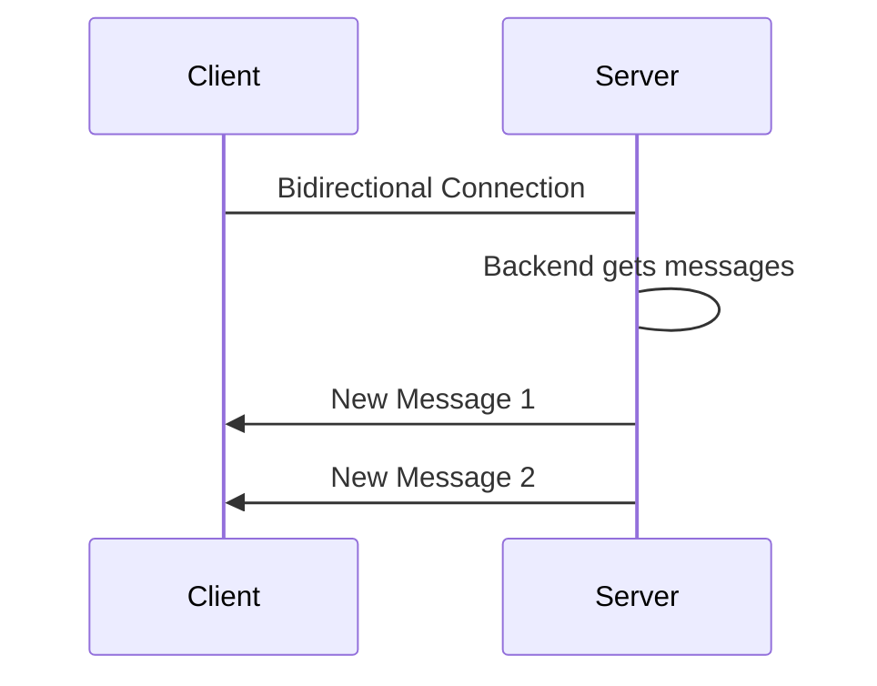

# Push

- [Push](#push)
  - [Push란?](#push란)
  - [Push의 장단점](#push의-장단점)

I want it as soon as possible

클라이언트에서 즉각적인 결과를 얻고 싶다면 빠른 응답을 보낼 수 있는 Push 방식을 사용할 수 있습니다.

Push Model은 실시간 알림과 같은 기능을 구현할 때 사용됩니다.

## Push란?

Push란 `RabbitMQ`와 같은 양방향 프로토콜을 사용하여 클라이언트에서 요청을 보내지 않아도 데이터를 전송하는 방식입니다.

서버에서 `RabbitMQ`의 큐 시스템에 데이터를 전송하면, `RabbitMQ`는 연결되어있는 클라이언트들에게 데이터를 푸시합니다.

> `RabbitMQ`는 내부적으로 `AMQP`(Advancded Message Queue Protocol)를 사용하고 있습니다.  
> 추가로 IoT 통신에서는 `MQTT`(Message Queueing Telemetry Transport)가 많이 사용됩니다.

## Push의 장단점

* 장점
  * Real time
* 단점
  * Clients must be online
  * Clients might not be able to handle
  * Requires a bidirectional protocal
  * Polling is preferred for light clients

> 참고자료  
> [AWS - Kafka와 RabbitMQ의 차이점은 무엇인가요?](https://aws.amazon.com/ko/compare/the-difference-between-rabbitmq-and-kafka/)  
> [IoT 통신을 위해 RabbitMQ를 선택한 이유](https://mahns.oopy.io/dev/1)  
> [MQTT vs AMQP for IoT](https://www.hivemq.com/article/mqtt-vs-amqp-for-iot/)
> [MQTT Essentials](https://www.youtube.com/playlist?list=PLRkdoPznE1EMXLW6XoYLGd4uUaB6wB0wd)

강의에서는 가장 단순한 형태의 Push 방식만을 다루고 있습니다. `AMQP`, `MQTT` 등 다른 메시징 프로토콜은 추후에 다루겠습니다.