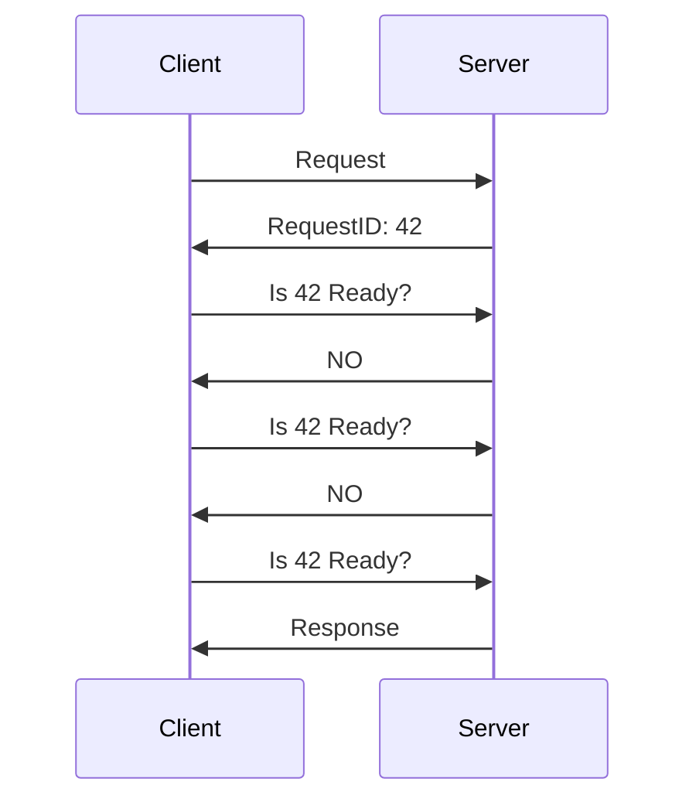

# Polling

- [Polling](#polling)
  - [Polling이란?](#polling이란)
  - [Polling의 장단점](#polling의-장단점)

Request is taking a while, I'll check with you later

## Polling이란?

Polling이란 서버에서 처리가 완료되었는지 지속적으로 확인하는 방식입니다.

클라이언트는 Request가 처리되었는지 확인하는 Short Request를 계속 보내서 확인합니다.

## Polling의 장단점

* 장점
  * 구현이 간단합니다.
  * 오래걸리는 작업을 요청을 처리하기 좋습니다.
  * 클라이언트가 연결을 끊을 수 있습니다.
* 단점
  * 요청이 지나치게 많아집니다.
  * 결과적으로 네트워크 대역폭이 낭비됩니다.
  * 서버의 리소스 또한 낭비됩니다.