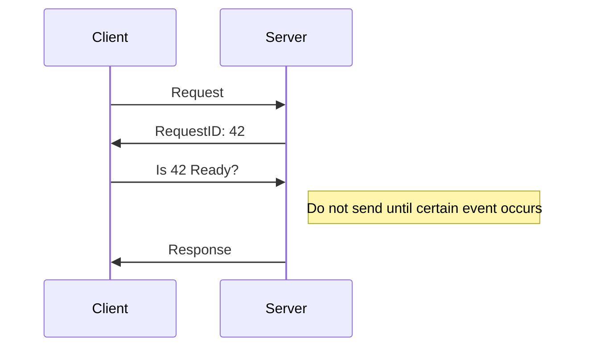

# Long Polling

- [Long Polling](#long-polling)
  - [Long Polling이란?](#long-polling이란)
  - [Long Polling의 장단점](#long-polling의-장단점)

Request is taking long, I'll check with you later
But talk to me only when it's ready

## Long Polling이란?

Long Polling이란 Polling과 비슷하지만 서버에서 응답을 즉시 보내지 않는다는 점이 다릅니다.

클라이언트에서 요청이 오면 서버에서는 즉시 응답을 보내는 것이 아니라,
특정 이벤트가 발생하거나 timeout이 발생하면 응답을 전달합니다.

> Long Polling를 사용하는 대표적인 예시로 `Kafka`가 있습니다.

## Long Polling의 장단점

* 장점
  * Polling에 비해 요청이 줄어듭니다.
* 단점
  * 실시간 통신이 어렵습니다.

> [Polling / Long Polling  / Server Sent Event / WebSocket 정리](https://inpa.tistory.com/entry/WEB-%F0%9F%93%9A-Polling-Long-Polling-Server-Sent-Event-WebSocket-%EC%9A%94%EC%95%BD-%EC%A0%95%EB%A6%AC)  
> [폴링(Polling), 롱 폴링(Long polling) 그리고 스프링 예제](https://junhyunny.github.io/information/spring-boot/polling-long-polling-and-spring-example/)  
> [[Spring][Websocket] polling, Long polling, Streaming, WebSocket 간단한 구현 코드로 알아보기 (1)](https://passionfruit200.tistory.com/487)  