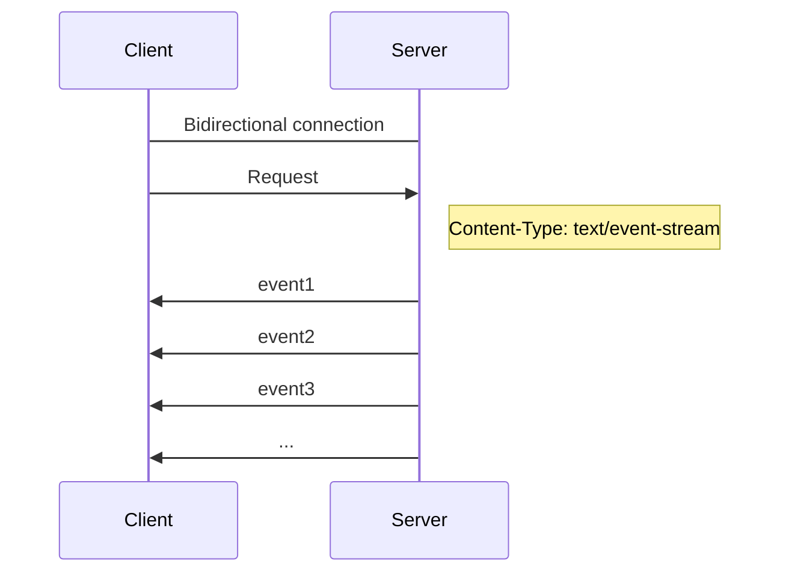

# Server Send Event

- [Server Send Event](#server-send-event)
  - [Server Send Event란?](#server-send-event란)
  - [Server Send Event의 장단점](#server-send-event의-장단점)

One Request, a very very long response

## Server Send Event란?
 
Server Send Event는 서버의 응답을 지속적으로 Streaming하는 방식 입니다.

**순수하게 Http로 동작**하기 떄문에 webSocket과 같은 다른 프로토콜을 사용하지 않아도 됩니다.

## Server Send Event의 장단점

* 장점
  * 실시간입니다.
  * Http 요청/응답 모델 기반 입니다.
* 단점
  * 클라이언트가 로그인 상태여야합니다.
  * 클라이언트가 응답을 처리하지 못할 수 있습니다.
  * 가벼운 사용자에게는 Polling이 좋을 수 있습니다.
  * Http/1.1에서 문제가 발생합니다. (6 connection limitation)

> [[NODE] 📚 Server Sent Events 💯 정리 (+사용법)](https://inpa.tistory.com/610)  