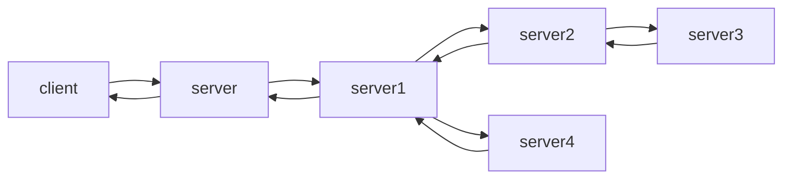
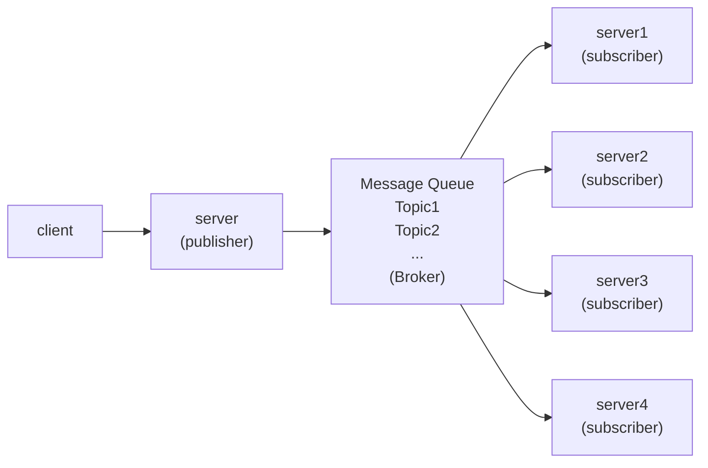

# Publish-Subscribe

- [Publish-Subscribe](#publish-subscribe)
  - [Publish-Subscribe란?](#publish-subscribe란)
  - [Publish-Subscribe 장단점](#publish-subscribe-장단점)

One publisher, many readers

## Publish-Subscribe란?

Publish-Subscribe는 하나의 요청을 여러 서버가 사용할 때 발생하는 문제점을 해결하기 위해 고안되었습니다.

기존의 흐름을 보면 하나의 클라이언트 요청이 하나의 서버에서 다른 서버로 오가는 것을 볼 수 있습니다.
만약 중간에 하나의 서버에 문제가 발생한다면 전체 서버에 영향을 줄 수 있습니다.
또한 `server1` 같은 경우에는 `server2`와 `server4`에 종속성을 갖기 떄문에 처리하기가 까다롭습니다.

위와 같이 중간에 Broker를 사용해서 메시지를 전달하기 때문에
server에서는 비동기로 모든 로직을 처리할 수 있고, 여러개의 Topic을 사용하여 의존성을 갖는 서버들의 흐름을 제어할 수 있습니다.

## Publish-Subscribe 장단점

* 장점
  * subscriber를 확장할 수 있습니다.
  * 마이크로서비스가 가능합니다.
  * 의존도가 낮아집니다.
  * 클라이언트가 없어도 중단되지 않습니다.
* 단점
  * subscriber가 실제로 메시지를 받았는지 혹은 중복으로 받았는지 알 수 없다.
  * 브로커나 파티션을 추가해야하기 때문에 복잡하다.
  * 폴링을 사용하는 경우 네트워크 혼잡이 발생할 수 있다.

> [AWS - 게시/구독 메시징이란 무엇인가요?](https://aws.amazon.com/ko/what-is/pub-sub-messaging/)    
> [KakaoCloud - Pub/Sub 개요](https://docs.kakaocloud.com/service/analytics/pub-sub/pub-sub-overview)  
> [Pub/Sub 모델](https://kchanguk.tistory.com/75)