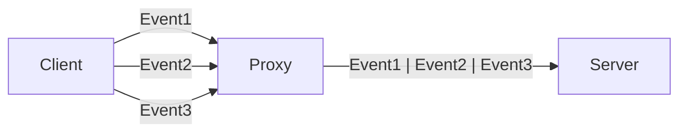
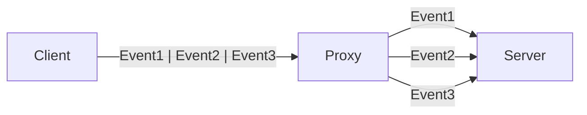
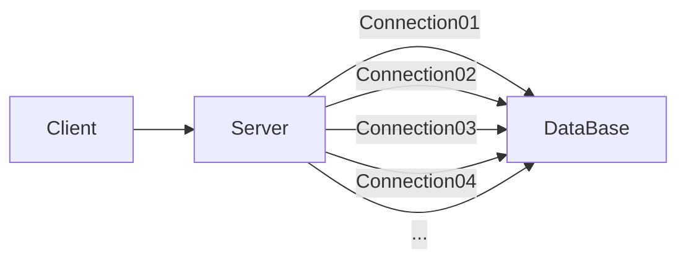
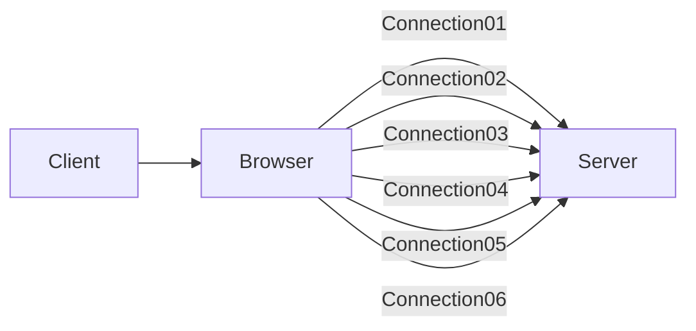
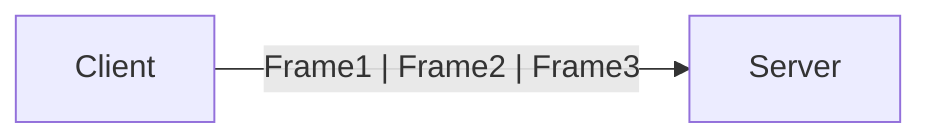

# Multiplexing

- [Multiplexing](#multiplexing)
  - [Multiplexing이란?](#multiplexing이란)
    - [Database Connection Pooling](#database-connection-pooling)
    - [HTTP/1.1 Browser](#http11-browser)

HTTP/2.0, QUIC, Connection Pool, MPTCP

## Multiplexing이란?

다중화(Multiplexing)는 여러 개의 데이터 스트림을 하나의 통신 채널을 통해 전송하는 기술입니다.

Multiplexing을 사용하면 여러 개의 요청을 동시에 전송할 수 있기 때문에 통신 효율을 높일 수 있습니다.

역다중화(Demultiplexing)은 반대로 다중화된 데이터 스트림을 다시 원래의 데이터 스트림으로 분리하는 기술입니다.

아래 예시에서 Client는 HTTP/1.1을 사용해서 Proxy 서버로 요청을 보내고,
Proxy에서는 HTTP/2.0을 사용해서 Server로 요청을 보냅니다.

Client는 여러 개의 TCP 연결을 사용해서 Proxy 서버로 동시에 여러개의 요청을 보낼 수 있습니다.
(대부분의 브라우저에서는 6개의 TCP 연결을 사용합니다.)

Proxy 서버는 이러한 요청들을 단일 스트림으로 Server에 전달합니다.

반대의 경우도 가능합니다.

첫번째 예시에서는 서버에서 다중화된 요청을 파싱해야하는 부담이 있고, 더 많은 리소스를 사용하기 때문에 성능이 저하될 수 있습니다.

아래 예시에서는 그 부담을 Proxy에서 부담하고, 서버에서는 각 요청이 독립적인 TCP 연결을 사용하게 되므로,
혼잡 제어하기 쉽고, 상호 간 영향을 받지 않습니다.

### Database Connection Pooling

다중화의 대표적인 예시로 DBCP(Database Connection Pool)가 있습니다.

DBCP는 데이터베이스 연결을 미리 여러 개 생성해두고, 요청이 들어올 때마다 미리 생성해둔 연결을 사용하는 기술입니다.

만약 미리 생성해둔 연결보다 많은 요청이 들어오면, 나머지 요청은 대기하게 됩니다.

연결 풀을 사용하는 것은 클라이언트의 요청을 서버에서 역다중화하는 것으로 볼 수 있습니다.

만약 DB에서 하나의 Connection에 여러 요청을 보낸다면,
DB에서 요청에 대한 결과를 순차적으로 보내거나 요청마다 특정 ID값을 부여해서 구분해야합니다.
(HTTP/1.1에서는 순차적으로 응답을 보내서 구분하고, HTTP/2.0에서는 Stream ID을 사용해서 다중화를 구현합니다.)

> 참고: [Database Connection Pooling](https://en.wikipedia.org/wiki/Connection_pool)

### HTTP/1.1 Browser

HTTP/1.1에서는 브라우저가 여러 개의 TCP 연결을 사용해서 다중화를 구현합니다.

대부분의 브라우저는 기본적으로 6개의 TCP 연결을 사용합니다.

HTTP/1.1에서 브라우저가 여러 개의 TCP 연결을 사용하는 이유는,
한 개의 TCP 연결에서 여러 요청을 보내면, 서버에서 요청을 구분하기 어렵기 때문입니다.
따라서 HTTP/1.1은 요청에 대한 응답을 반드시 순차적으로 보내야합니다.

이는 파이프라이닝을 구현할 때 HOLB(Head of Line Blocking) 문제를 발생시킵니다.
HOLB 문제는 하나의 요청이 지연되면, 그 이후의 요청도 지연되는 문제입니다.
이를 해결하기 위해 대부분의 브라우저에서는 6개의 TCP 연결을 사용합니다. 
또한 HTTP/2.0에서는 Binary Framing Layer를 사용하여 다중화를 지원합니다.

HTTP/2.0에서는 데이터를 스트림 단위로 분할하고, 각 프레임에 Stream ID를 부여해서 다중화를 구현합니다.
이를 통해 하나의 TCP 연결에서 여러 개의 요청을 동시에 보내도 서버에서 요청을 구분할 수 있고,
응답도 순차적으로 보내지 않아도 되기 때문에 HOLB 문제를 해결할 수 있습니다.

