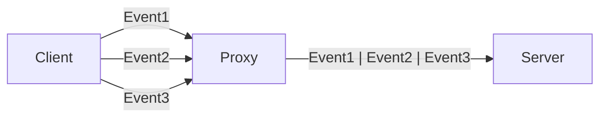
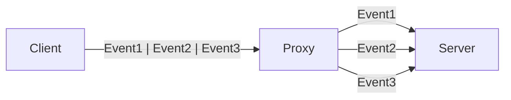

# Multiplexing

- [Multiplexing](#multiplexing)
  - [Multiplexing이란?](#multiplexing이란)
  - [Connection Pooling이란?](#connection-pooling이란)

HTTP/2.0, QUIC, Connection Pool, MPTCP

## Multiplexing이란?

다중화(Multiplexing)는 여러 개의 데이터 스트림을 하나의 통신 채널을 통해 전송하는 기술입니다.

Multiplexing을 사용하면 여러 개의 요청을 동시에 전송할 수 있기 때문에 통신 효율을 높일 수 있습니다.

역다중화(Demultiplexing)은 반대로 다중화된 데이터 스트림을 다시 원래의 데이터 스트림으로 분리하는 기술입니다.

아래 예시에서 Client는 HTTP/1.1을 사용해서 Proxy 서버로 요청을 보내고,
Proxy에서는 HTTP/2.0을 사용해서 Server로 요청을 보냅니다.

Client는 여러 개의 TCP 연결을 사용해서 Proxy 서버로 동시에 여러개의 요청을 보낼 수 있습니다.
(대부분의 브라우저에서는 6개의 TCP 연결을 사용합니다.)

Proxy 서버는 이러한 요청들을 단일 스트림으로 Server에 전달합니다.

반대의 경우도 가능합니다.

첫번째 예시에서는 서버에서 다중화된 요청을 파싱해야하는 부담이 있고, 더 많은 리소스를 사용하기 때문에 성능이 저하될 수 있습니다.

아래 예시에서는 그 부담을 Proxy에서 부담하고, 서버에서는 각 요청이 독립적인 TCP 연결을 사용하게 되므로,
혼잡 제어하기 쉽고, 상호 간 영향을 받지 않습니다.

## Connection Pooling이란?
