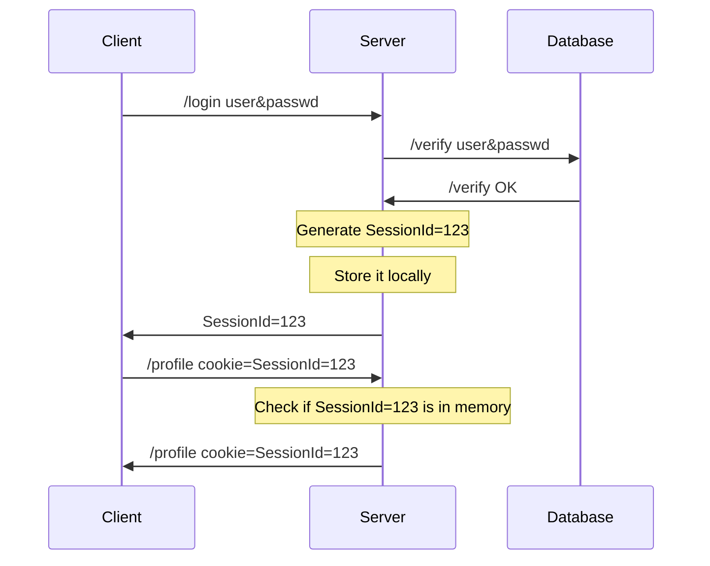

# Stateless

- [Stateless](#stateless)
  - [Stateful vs Stateless](#stateful-vs-stateless)
  - [백엔드 서버에서의 Stateless](#백엔드-서버에서의-stateless)
    - [Stateless Backends](#stateless-backends)
    - [Stateful Backends](#stateful-backends)
  - [프로토콜에서의 Stateless](#프로토콜에서의-stateless)

Is State stored in the backend?

## Stateful vs Stateless

Stateful
* Stores state aboute clients in the memory
* 클라이언트의 상태를 메모리에 저장하고
* Depends on the Information being there
* 그 정보가 있다는 것에 의존합니다.

Stateless
* Client is responsible to "transfer the state" with every request
* 클라이언트가 매 요청마다 상태를 전송해야합니다.
* May store but can safely lose it
* 서버는 클라이언트의 정보를 저장할 수 있지만, 잃어버려도 안전합니다.

## 백엔드 서버에서의 Stateless

### Stateless Backends

무상태 백엔드 서버는 DB와 같은 외부에 데이터(상태)를 저장해야합니다.

서버는 무상태여도 시스템 자체는 상태를 가질 수 있습니다.

또한 서버를 재시작하더라도 클라이언트의 요청은 계속해서 처리할 수 있어야합니다.

### Stateful Backends

상태를 저장하는 백엔드 서버는 클라이언트의 상태를 저장하고, 이를 이용해서 다음 요청을 처리합니다.

대표적인 예시로 세션을 사용하는 웹 서버가 있습니다.

Session은 서버의 메모리에 저장되어 있기 때문에
해당 유저를 식별하기 위해더 이상 데이터베이스를 조회하지 않아도 되지만,
서버가 재시작하면 세션 정보가 사라집니다.

이는 로드밸런싱을 사용할 때 문제가 될 수 있습니다.
서버의 상태에 따라 하나의 서버에서 로그인을 하고, 다른 서버에서 프로필을 조회할 수 있기 때문입니다.

만약 서버에서 무상태를 위해 세션을 DB에 저장한다면
인가를 위한 추가적인 DB 조회가 필요하기 때문에 성능이 저하될 수 있습니다.

## 프로토콜에서의 Stateless

* The Protocol can be designed to store data.
* TCP is stateful
  * Sequence number, Connection file descriptor etc.
* UDP is stateless
  * DNS sends `queryId` in UDP to identify queryies
  * QUIC sends `connectionId` to identify connections
* You can design a stateful protocol on top of a stateless protocol and vice versa.
  * HTTP는 TCP 위에서 동작하지만 Stateless 입니다.
    * HTTP는 상태를 전달하기 위해 Cookie를 사용합니다.
  * QUIC는 UDP 위에서 동작하지만 Stateful 입니다.

완전히 무상태인 시스템은 많이 없습니다.
완전히 무상태인 시스템에서는 클라이언트에서 모든 요청마다 상태를 전달해야합니다.
다음은 무상태로 동작하는 시스템의 예시입니다.
* 클라이언트의 입력값에 완전히 의존하는 백엔드 서버 (ex. 계산기, 소수판별기 등)
* JWT(Json Web Token)를 사용하는 인증 시스템
