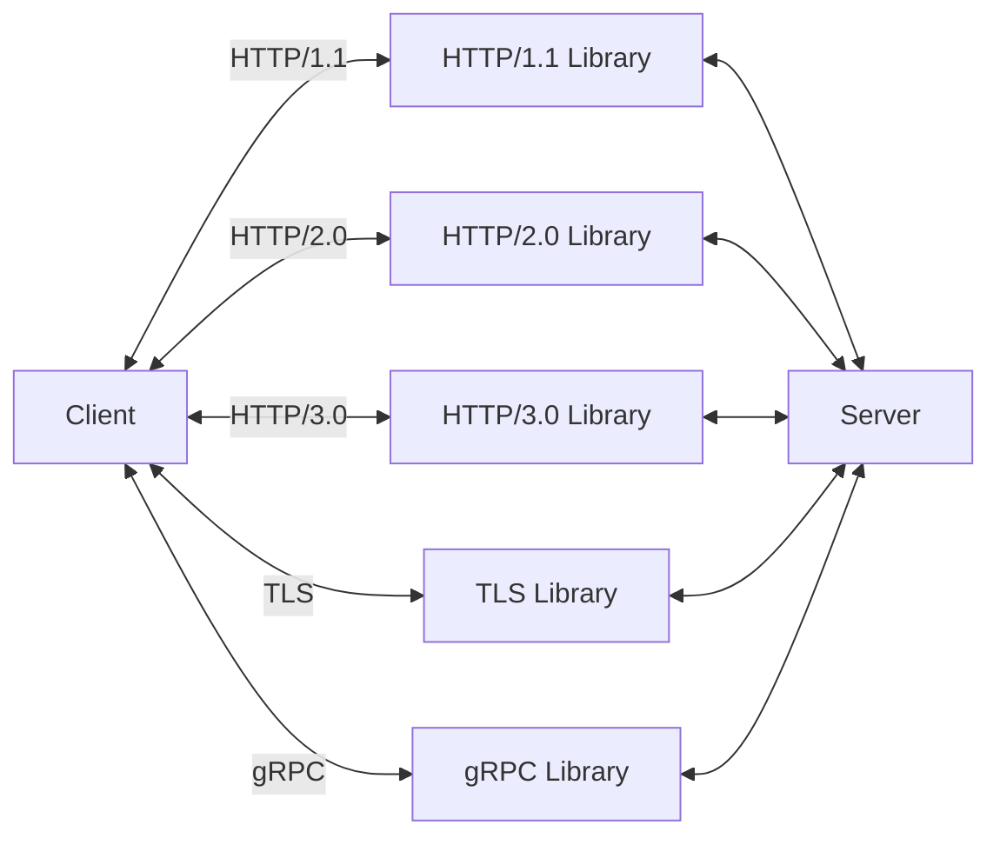
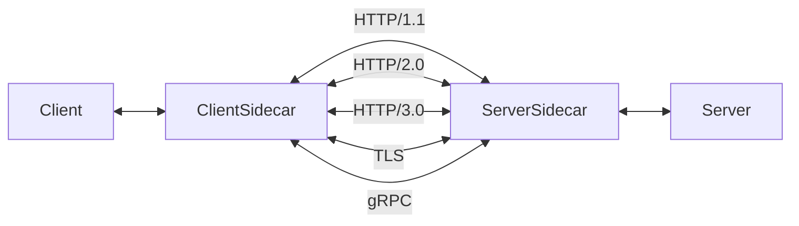

# Sidecar Pattern

- [Sidecar Pattern](#sidecar-pattern)
  - [Sidecar Pattern이란?](#sidecar-pattern이란)

Thick clients, Thicker backends

## Sidecar Pattern이란?

> "사이드카"는 오토바이 옆에 달린 보조 좌석을 의미합니다.

사이드카 패턴은 기본 컨테이너의 기능을 확장하거나 보조하는 용도의 **프록시 컨테이너**를 추가하는 패턴입니다.
이 패턴을 사용하면 어플리케이션의 주요 기능을 보조하는 라이브러리를 별도의 컨테이너로 배치하여 어플리케이션의 기능을 확장하거나 업데이트할 수 있습니다.

보조 라이브러리에는 프로토콜 변환, 로깅, 모니터링 등이 있습니다.

예를들어 서버에서 HTTP/1.1, HTTP/2.0, TLS, gRPC 등 다양한 프로토콜을 지원하려면,
모든 라이브러리를 설치하고 해당 라이브러리를 사용한 API를 각각 구현해야합니다.

하지만 사이드카 패턴을 사용하면 이러한 라이브러리를 별도의 컨테이너로 배치하여 기본 컨테이너와 연결하면 됩니다.
이를 Service Mesh라고 하며, 대표적인 예로는 Linkerd나 Istio가 있습니다.

만약 Linkerd 서비스 메시 프록시를 사용는 경우,
HTTP/2.0을 지원하는 서버에서 HTTP/3.0을 추가하고 싶다면, 단지 Linkerd를 업데이트하는 것만으로 가능합니다.

## Sidecar Pattern의 장단점

* 장점:
  * 프로토콜 변환이나 보안 업데이트를 쉽게 할 수 있습니다.
  * 로그 추적이나 모니터링, 캐싱 등의 기능을 쉽게 추가할 수 있습니다.
* 단점:
  * 복잡도가 증가합니다.
  * 네트워크 오버헤드가 발생하거나 성능이 저하될 수 있습니다. 